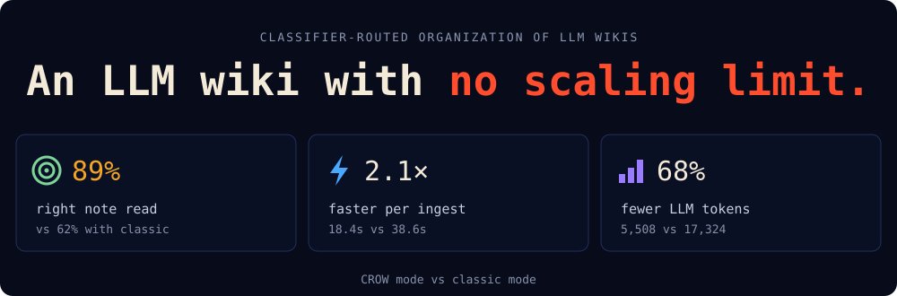
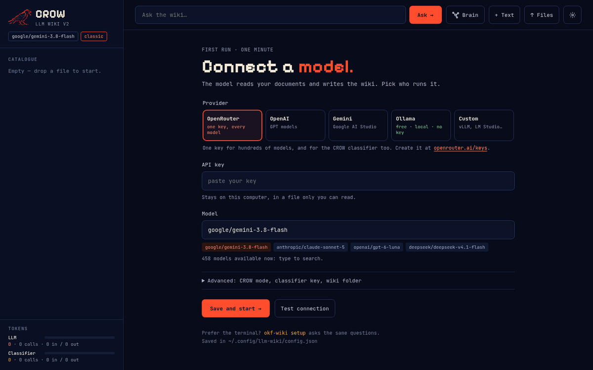

<p align="center">
  
</p>

<p align="center">
  
</p>

# LLM Wiki v2

Give it your documents. It files them into a tidy wiki of Markdown notes and
answers your questions, citing the notes it used. It runs on your computer,
with any AI provider: OpenRouter, OpenAI, Gemini, Ollama (free and local) or
any OpenAI-compatible server. It works in **CROW** mode by default: a small
classifier decides where things go, so the wiki stays fast and cheap as it grows.

## Start in 3 steps

**1. Install uv**, the tool that installs Python apps ([other ways](https://docs.astral.sh/uv/getting-started/installation/)):

```bash
curl -LsSf https://astral.sh/uv/install.sh | sh
```

**2. Install the wiki:**

```bash
uv tool install "llm-wiki-v2[server] @ git+https://github.com/fed3c3sa/llm-wiki-v2"
```

**3. Start it:**

```bash
okf-wiki
```

Your browser opens. Pick a provider, paste its key, press **Test connection**,
then **Save and start**. That's it.

**Just looking?** `okf-wiki demo` opens an example wiki, the notes of a fictional coffee
roastery, with no key needed to browse it and its brain. It is copied to `~/llm-wiki-demo`,
so you can add to it or delete it.

<p align="center">
  
</p>

> [!TIP]
> **No key?** Pick **Ollama**: free, runs on your computer, no account
> ([download it](https://ollama.com/download), then `ollama pull gemma4`).
> CROW's classifier runs on OpenRouter, so without an OpenRouter key the wiki
> uses classic mode, where the model decides by itself.
> One [OpenRouter key](https://openrouter.ai/keys) works for every model, and for CROW too.

## What you can do

| | |
|---|---|
| **Add documents** | Drop `.txt`, `.md` or `.pdf` files anywhere on the page. Each one lands in the right folder, merged with what the wiki already knows. |
| **Ask questions** | Type a question. The answer cites the notes it used: click one to read it. |
| **See the brain** | A live map of your folders, notes and links. |
| **Keep your files** | Plain Markdown in `~/llm-wiki`: open it in any editor, keep it in git. |

## Something wrong?

- **"no API key yet"**: open ⚙ on the page, or run `okf-wiki setup` in the terminal.
- **Test connection fails**: the message is the provider's own, usually a wrong key or model name.
- **A PDF adds nothing**: it is a scan with no text layer; run OCR on it first.
- **Another folder for the wiki**: `okf-wiki --bundle <folder>`. Settings live in `~/.config/llm-wiki/config.json`.

## For developers

<details>
<summary><b>Run it as a server with Docker</b></summary>

```bash
git clone https://github.com/fed3c3sa/llm-wiki-v2 && cd llm-wiki-v2
cp .env.example .env          # choose OKF_LLM_PROVIDER and set its key
docker compose up -d --build  # the wiki on :8000 (OKF_PORT to change)
```

With Docker the settings come from `.env`; the page shows them but cannot change them.

</details>

<details>
<summary><b>HTTP API</b></summary>

**The web UI** at http://localhost:8000 shows the folder tree, renders each note
(with its See-also links and sources), answers questions with clickable
citations, and shows the tokens spent by the LLM and by the classifier. Drop
`.txt`, `.md` or `.pdf` files anywhere on the page and each one is catalogued
automatically; PDFs need a text layer (scanned PDFs need OCR first).

The same through the API:

```bash
curl -X POST localhost:8000/ingest -H 'content-type: application/json' \
     -d '{"text": "Acme refunds orders within 30 days of delivery.", "title": "Refund policy"}'
curl -X POST 'localhost:8000/upload?filename=minutes.pdf' --data-binary @minutes.pdf
curl -X POST localhost:8000/ask -H 'content-type: application/json' \
     -d '{"question": "How long do customers have to ask for a refund?"}'
```

The wiki is plain Markdown files you can read, edit and keep in git (`./wiki`
with Docker). The API docs are at http://localhost:8000/docs; with Docker the
CLI runs in the same image: `docker compose run --rm wiki okf-wiki check`.

| Endpoint | What it does |
|---|---|
| `GET /` | the web UI |
| `POST /ingest` `{text, title?, resource?}` | file a source; returns the note, folders created, links and token usage |
| `POST /upload?filename=…` (raw file body) | file a `.txt`, `.md` or `.pdf` file |
| `POST /ask` `{question}` | answer with citations; returns the notes read and token usage |
| `GET /tree` · `GET /note?path=…` | folder tree · one note (frontmatter and Markdown body) |
| `GET /check` · `GET /graph` | lint problems · the wiki as nodes and links (JSON) |
| `GET /usage` · `GET /health` | token totals per ledger and model · status |
| `GET /settings` · `POST /settings` · `POST /settings/test` | provider, model and key (masked) · save them · try them; changes from this machine only |

</details>

<details>
<summary><b>Use it as a Python library and from the command line</b></summary>

```bash
pip install "llm-wiki-v2[server] @ git+https://github.com/fed3c3sa/llm-wiki-v2"
```

```python
from okf_wiki import Wiki

wiki = Wiki.from_env(bundle="./wiki")        # OKF_* variables and the provider's key, e.g. OPENROUTER_API_KEY
wiki.init()

result = wiki.ingest(open("meeting.md").read(), title="Pricing meeting")
wiki.ingest_file(open("minutes.pdf", "rb").read(), "minutes.pdf")   # .txt, .md or .pdf
print(result.action, result.note, result.created_folders, result.related)

answer = wiki.ask("What did we decide about enterprise pricing?")
print(answer.text, answer.citations)

print(wiki.usage.to_dict())                  # {"llm": …, "classifier": …, "by_model": …}
```

The same operations are on the command line:

```bash
okf-wiki --bundle ./wiki init
okf-wiki --bundle ./wiki ingest meeting.md     # or a .txt / .pdf
okf-wiki --bundle ./wiki --mode classic ask "What did we decide about pricing?"
okf-wiki --bundle ./wiki check        # lint: OKF conformance, index drift, broken links
okf-wiki --bundle ./wiki serve        # the HTTP API and page (needs the [server] extra); plain `okf-wiki` also opens the browser
okf-wiki setup                        # provider, key and model, tested and saved
okf-wiki demo                         # an example wiki, copied to ~/llm-wiki-demo and opened
```

Everything is a class you can subclass. `Librarian` and `Researcher` share an
`Agent` base; the CROW versions override only their decision hooks. To change a
behaviour, override one method and hand your class to `Wiki`:

```python
from okf_wiki import Wiki
from okf_wiki.librarian import Librarian

class QuietLibrarian(Librarian):
    def pick_related(self, note, others):
        return []                            # never add See-also links

class MyWiki(Wiki):
    def librarian(self):
        return QuietLibrarian(self.store, self.llm, self.prompts, self.cfg)
```

</details>

<details>
<summary><b>How it works: classic and CROW</b></summary>

```
ingest:  summarize → route → find match → merge or (new folder →) write → relate → link, index, log
ask:     select notes (navigate the tree) → answer from them, with [path.md] citations
```

| Step | Classic mode (`OKF_MODE=classic`) | CROW mode (`OKF_MODE=crow`) |
|---|---|---|
| Summarize the source into a note | LLM | LLM (optional, `OKF_SUMMARIZE=false` files it verbatim) |
| Route: best folder, or a new one | LLM, one level at a time | classifier Choice per level, beam search, LLM fallback |
| Same subject as an existing note? | LLM | classifier Noul per note |
| Merge into it, or write a new note? | LLM | classifier Choice, unsure → new note |
| Name a new folder · rewrite a merged note | LLM | LLM |
| Related notes (See also) | LLM | classifier Noul per note |
| Find the notes for a question | LLM navigation | classifier Noul per folder and note, LLM fallback |
| Write the answer | LLM | LLM |

Both modes run the same pipeline and write the same kind of wiki: only the
decider changes. CROW follows *CROW: Classifier-Routed Organization of LLM
Wikis* (Cesarini & Sassarini, 2026) — see [docs/wiki/crow.md](docs/wiki/crow.md)
for thresholds and fallbacks.

**Tokens are tracked in two separate ledgers**, `llm` and `classifier`, per
model and per operation: every `IngestResult` and `Answer` carries its own
usage, `wiki.usage` / `GET /usage` the totals, and `OKF_USAGE_LOG` writes one
JSON line per model call.

</details>

<details>
<summary><b>The wiki on disk</b></summary>

> The wiki's on-disk format is derived from Google's
> **[Open Knowledge Format (OKF) v0.2](https://github.com/GoogleCloudPlatform/open-knowledge-format)**:
> every wiki written here is a conformant OKF bundle, with the extra conventions
> listed below. This project started as a fork of OKF and no longer includes its code.

```
wiki/
  index.md                     # root index (okf_version "0.2")
  log.md                       # what changed, newest first
  raw/                         # untouched copy of every source ingested
  customer-policies/
    index.md                   # * [Refund policy](refund-policy.md) - How Acme refunds orders…
    refund-policy.md           # type: Note, title, description, tags, generated, sources
```

Every note is an OKF concept (`type: Note`) whose `description` is its one-line
summary and whose `sources` point to the raw copies it was written from. Each
folder's one-line description sits in its parent's `index.md`, where both people
and the Librarian read it. Related notes are joined by a `# See also` section
with relative links. `okf-wiki check` verifies all of this.

**How it relates to OKF v0.2.** A wiki written here is a conformant OKF bundle
(§11): every note has a YAML frontmatter block with a `type`, and `index.md` and
`log.md` follow §8 and §9. On top of that it adds its own conventions:

- every folder has an `index.md`, and a folder's description is its entry in the parent's index (OKF: optional indexes);
- links are relative (OKF recommends bundle-absolute `/…` links), and `check` reports broken ones;
- `raw/` holds the sources (`type: Source`), `# See also` holds the related notes, and there is one `log.md`, at the root.

It does not use OKF's trust and lifecycle fields (`verified`, `status`,
`stale_after`), attested computations (§10) or the `references/` convention.
Wikis are not checked against later OKF versions.

</details>

<details>
<summary><b>Configuration</b></summary>

The settings page and `okf-wiki setup` cover provider, key, model, mode and
wiki folder. Everything else, and every setting in Docker (`.env`) or in the
library, comes from the environment; it wins over the settings file. The full
list is in [.env.example](.env.example).

| Variable | Default | Meaning |
|---|---|---|
| `OKF_BUNDLE` | `~/llm-wiki` for the CLI (`/data/wiki` in Docker) | wiki folder |
| `OKF_MODE` | `crow` | `crow` (a typed classifier decides, needs an OpenRouter key) or `classic` (the LLM decides) |
| `OKF_LLM_PROVIDER` | `openrouter` | `openrouter`, `openai`, `gemini`, `ollama` or `custom` |
| `OKF_LLM_MODEL` | the provider's default | e.g. `google/gemini-3.8-flash` on OpenRouter |
| `OKF_LLM_BASE_URL` | the provider's | any OpenAI-compatible API (required for `custom`) |
| `OPENROUTER_API_KEY` · `OPENAI_API_KEY` · `GEMINI_API_KEY` | — | the provider's key (`OKF_LLM_API_KEY` wins); OpenRouter's also serves the classifier |
| `OKF_CLASSIFIER_MODEL` | `typesafe/jev-1.13` | CROW classifier, pinned |
| `OKF_CLASSIFIER_BASE_URL` | `https://openrouter.ai/api/v1` | System One endpoint |
| `OKF_CONFIG` | `~/.config/llm-wiki/config.json` | the settings file |
| `OKF_PROMPTS_DIR` | — | folder whose prompt files replace the packaged ones |
| `OKF_LLM_EXTRA_BODY` | — | JSON added to every LLM request, e.g. `'{"provider":{"order":["together"]}}'` to pin fast OpenRouter providers |

Providers, the settings file and the classifier route: [docs/wiki/providers.md](docs/wiki/providers.md).
Prompts, one Markdown file each: [docs/wiki/prompts.md](docs/wiki/prompts.md).

</details>

<details>
<summary><b>Project layout and development</b></summary>

```
src/okf_wiki/            the LLM wiki: config, settings, usage, llm, classifier, document, store, files, librarian, researcher, wiki, cli, server
src/okf_wiki/web/        the web UI: plain ES modules, no build step; vendor/ holds marked, DOMPurify, d3 and the fonts
src/okf_wiki/prompts/    shared/, librarian/, researcher/, classifier/ — one prompt per file
src/okf_wiki/demo/       the example wiki behind `okf-wiki demo` (a fictional roastery)
tests/wiki/              tests for every feature, with scripted fake models (no network)
docs/wiki/               providers, CROW, prompts
```

```bash
python3.13 -m venv .venv && .venv/bin/pip install -e ".[dev]"
.venv/bin/pytest
```

Tests never call a real model: they use the scripted fakes in `tests/wiki/fakes.py`.
Keep changes in the style of the surrounding code (typed, class-based, one
prompt per file under `src/okf_wiki/prompts/`), with a test for every behaviour
you change.

</details>


## Credits and license

- **Open Knowledge Format** by Google LLC —
  [GoogleCloudPlatform/open-knowledge-format](https://github.com/GoogleCloudPlatform/open-knowledge-format),
  Apache-2.0. The wiki format is derived from OKF v0.2; see [NOTICE](NOTICE).
- **CROW** — F. Cesarini, M. Sassarini, *CROW: Classifier-Routed Organization of
  LLM Wikis*, preprint, 2026, [doi:10.5281/zenodo.22900601](https://doi.org/10.5281/zenodo.22900601).
- **LLM Wiki** — A. Karpathy, [LLM Wiki](https://gist.github.com/karpathy/442a6bf555914893e9891c11519de94f), 2026.
- The Librarian / Researcher design follows F. Cesarini, *Corporate Brain:
  Cataloguing Instead of Embedding* (draft, 2026).
- The web UI ships [marked](https://github.com/markedjs/marked) (MIT),
  [DOMPurify](https://github.com/cure53/DOMPurify) (Apache-2.0 / MPL-2.0) and
  [d3](https://github.com/d3/d3) (ISC), and the fonts Pixelify Sans, JetBrains Mono
  and IBM Plex Sans (SIL Open Font License 1.1); see [NOTICE](NOTICE).

Licensed under the [Apache License 2.0](LICENSE.md). To cite this software, see
[CITATION.cff](CITATION.cff).
